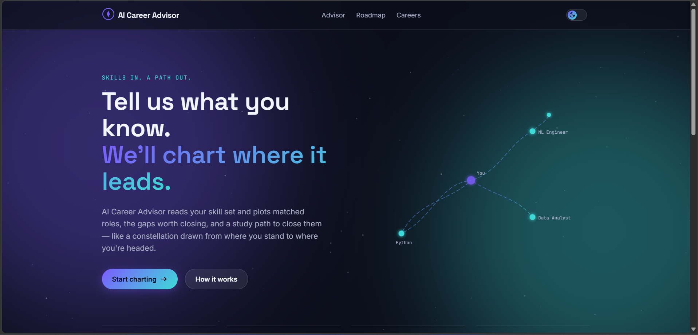
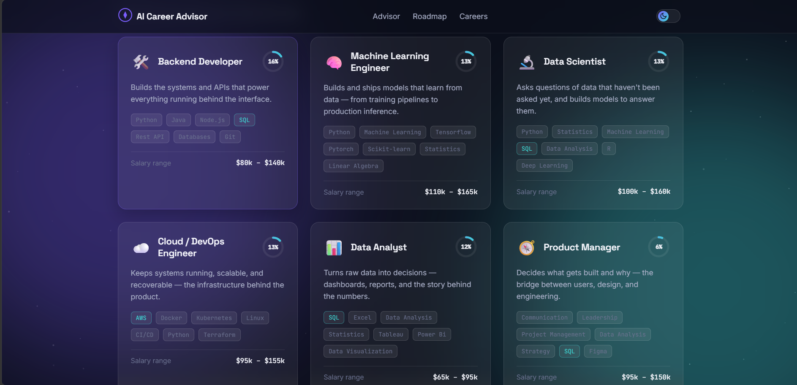
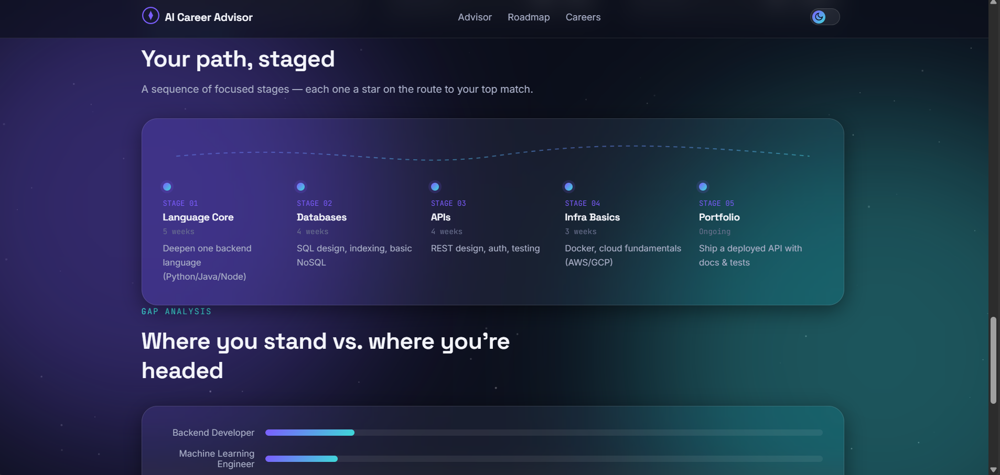

# 🎓 AI Career Advisor

<p align="center">
  
</p>

A modern, responsive **AI-powered Career Guidance Web Application** that helps students and professionals discover suitable career paths based on their interests, skills, and educational background.

---

## 📌 Overview

Choosing the right career can be difficult. The **AI Career Advisor** provides intelligent career recommendations by analyzing user-selected interests, skills, and education level.

The application presents personalized career suggestions along with essential information such as required skills, career growth opportunities, salary expectations, and learning paths.

---

## ✨ Features

- 🤖 AI-inspired Career Recommendation System
- 🎯 Personalized Career Suggestions
- 📚 Detailed Career Information
- 💼 Required Skills & Qualifications
- 📈 Career Growth Outlook
- 💰 Salary Information
- 📄 PDF Report Generation
- 🌙 Modern Dark UI
- 📱 Fully Responsive Design
- ⚡ Fast & Lightweight

---

## 🛠️ Technologies Used

| Technology       | Purpose               |
| ---------------- | --------------------- |
| HTML5            | Structure             |
| CSS3             | Styling               |
| JavaScript (ES6) | Application Logic     |
| jsPDF            | PDF Report Generation |
| Google Fonts     | Typography            |

---

## 📂 Project Structure

```
AI-Career-Advisor/
│
├── screenshots/
│   ├── home.png
│   ├── recommendations.png
│   └── details.png
│
├── careerData.js
├── index.html
├── script.js
├── style.css
├── LICENSE
└── README.md
```

---

## 🚀 How to Run

### Clone the Repository

```bash
git clone https://github.com/zuhaibali64/ai-career-advisor.git
```

### Open the Project

```bash
cd ai-career-advisor
```

Open **index.html** using:

- Live Server (Recommended)
- OR double-click `index.html`

---

## 📸 Screenshots

### 🏠 Home Page


---

### 🎯 Career Recommendations



---

### 📋 Career Details



---

## 🎯 Future Improvements

- Machine Learning Recommendation Model
- Resume Analyzer
- Personality Assessment
- User Authentication
- Career Roadmap Generator
- Job Portal Integration
- AI Chatbot
- Database Support
- Cloud Deployment


## 🤝 Contributing

Contributions are welcome.

1. Fork the repository
2. Create a feature branch
3. Commit your changes
4. Push to the branch
5. Open a Pull Request

---

## 👨‍💻 Author

**ZUHAIB ALI**

- GitHub: https://github.com/zuhaibali64

---

## ⭐ Support

If you found this project helpful, please consider giving it a ⭐ on GitHub.

---

## 📄 License

This project is licensed under the MIT License.**git** add .
